### Report:
1. High-level overview of your design (Use diagrams and pictures for your data structures).
2. Detailed description of each function and its time complexity.
3. Time spent for each function.
4. Discussion, conclusion, and lessons learned.

# EE538 Final Project Spring 2022 Report (TrojanMap)

## Group members: Jiayu Guo, Yubo Zhang

## The presentation Link is:

## TrojanMap

This project focuses on using data structures in C++ and implementing various graph algorithms to build a map application.

<p align="center"></p>

---

## The data Structure

Each point on the map is represented by the class **Node** shown below and defined in [trojanmap.h](src/lib/trojanmap.h).

```cpp
class Node {
  public:
    Node(){};
    Node(const Node &n){id = n.id; lat = n.lat; lon = n.lon; name = n.name; neighbors = n.neighbors; attributes = n.attributes;};
    std::string id;    // A unique id assign to each point
    double lat;        // Latitude
    double lon;        // Longitude
    std::string name;  // Name of the location. E.g. "Bank of America".
    std::vector<std::string> neighbors;  // List of the ids of all neighbor points.
    std::unordered_set<std::string> attributes;  // List of the attributes of the location.
};
```

```shell
TrojanMap
**************************************************************
* Select the function you want to execute.                    
* 1. Autocomplete                                             
* 2. Find the location                                        
* 3. CalculateShortestPath                                    
* 4. Travelling salesman problem                              
* 5. Cycle Detection                                          
* 6. Topological Sort                                         
* 7. Find Nearby                                              
* 8. Exit                                                     
**************************************************************
Please select 1 - 8:
```
## Step 1: Autocomplete the location name:

### 1.1 Function
```c++
std::vector<std::string> TrojanMap::Autocomplete(std::string name);
```
In this function, we give a partial name and return all the possible locations with partial name as prefix, and the function should be case-insensitive.

First, we check if the input name have blank space at the end of the input, earse it, but not earse the blank space in the middle of input name, and then we transform the input name and all the location name of data to lowercase. Then we go through data and if we find the name, we push back the result to the vector

**Time Complexity:** O(n*name.size()). n represents the number of nodes in the map. name.size() represents the number of characters of the input name. The fist for-loop costs O(n) and the second for-loop costs O(name.size()).


### 1.2 Result
```shell
**************************************************************
* 1. Autocomplete                                             
**************************************************************

Please input a partial location:ch(fllow with two blank space"  ")
*************************Results******************************
Chinese Street Food
Chase
Chevron 2
Chucks Chicken & Waffles
Cheebos Burger
Chick-fil-A
Chevron 1
Church of Christ
Chipotle
Chase Plaza Heliport
Chevron
**************************************************************
Time taken by function: 35 ms
```

## Step 2: Find the place;s Coordinates in Map
```c++
std::pair<double, double> GetPosition(std::string name);
```
## 2.1 function
The input is the location name, and we want the lat and longitude from it, if the given location DNE, then return -1
First, we find the node of the input location name, then we go through the node of data, if the node name  is the input location name, we return the lat and longitude in pair.

**Time Complexity:** O(n*name.size()), n represents the number of nodes in map.

## 2.2 Results

```shell
* 2. Find the location                                        
**************************************************************

Please input a location:Target
*************************Results******************************
Latitude: 34.0257 Longitude: -118.284
**************************************************************
Time taken by function: 11 ms
```

<p align="center"></p>

## Step3: CalculateShortestPath between two places:

### 3.1 Dijkstra.
```c++
std::vector<std::string> CalculateShortestPath_Dijkstra(std::string &location1_name, std::string &location2_name);
```

Use ```priority_queue``` to implement Dijkstra Algorithm. The input is the names of start locaton and end location.
- First, we initialize the unordered_map ```distance```, which records the shortest distance value between the location and the source node. The values of ```distance``` are set to INT_MAX and we assign distance value as 0 for the source node, so that it can be picked first.
- Then we use priority_queue ```q```, which is the min-heap, to record the pair of the shortest distance to the start node and the location id. the advantage is find the node with the shortest distance cost O(logn).
- While ```q``` is not empty, we implement edge relaxation. We choose a ```min_node``` with the shortest distance to the source node. Iterate through all the neighbors of ```min_node```, for every neighbor, if the new distance value is less than the original one, then its distance value will be updated. 
- When implementing edge relaxation, we use unordered_map ```prev``` to record the predecessor of the node. If the distance value of min_node's neighbor is updated, then the predecessor of the neighbor is ```min_node```.
- When ``min_node`` is the destination node, we break the while loop. Then the shortest distance tree from the source node to the destination node can be got with the help of ```prev```.

**Time complexity:** O((m+n)*logn). m represents the number of edges and n represents the number of nodes.

```c++
  std::vector<std::string> path;
  std::priority_queue< std::pair<double, std::string>, std::vector< std::pair<double, std::string>>, 
                       std::greater<std::pair<double, std::string>>> q; //priority_queue greater functional, visit list
  std::unordered_map<std::string, double> distance;//distance map of the nodes
  std::unordered_map<std::string, std::string> prev; //record the node and its predecessor
  std::string start = GetID(location1_name);//get the location id
  std::string end = GetID(location2_name);
```
### 3.1.1 Dijkstra Results
```shell
**************************************************************
* 3. CalculateShortestPath                                    
**************************************************************

Please input the start location:Ralphs
Please input the destination:Chick-fil-A
*************************Dijkstra*****************************
*************************Results******************************
"2578244375","4380040154","4380040153","4380040152","4380040148","6818427920","6818427919","6818427918","6818427892","6818427898","6818427917","6818427916","7232024780","6813416145","6813416154","6813416153","6813416152","6813416151","6813416155","6808069740","6816193785","6816193786","123152294","4015203136","4015203134","4015203133","21098539","6389467809","4015203132","3195897587","4015203129","4015203127","6352865690","6813379589","6813379483","3402887081","6814958394","3402887080","602606656","4872897515","4399697589","6814958391","123209598","6787673296","122728406","6807762271","4399697304","4399697302","5231967015","1862347583","3233702827","4540763379","6819179753","6820935900","6820935901","6813379556","6820935898","1781230450","1781230449","4015405542","4015405543","1837212104","1837212107","2753199985","6820935907","1837212100","4015372458","6813411588","1837212101","6814916516","6814916515","6820935910","4547476733",
The distance of the path is:1.49919 miles
**************************************************************
Time taken by function: 206 ms
```

<p align="center">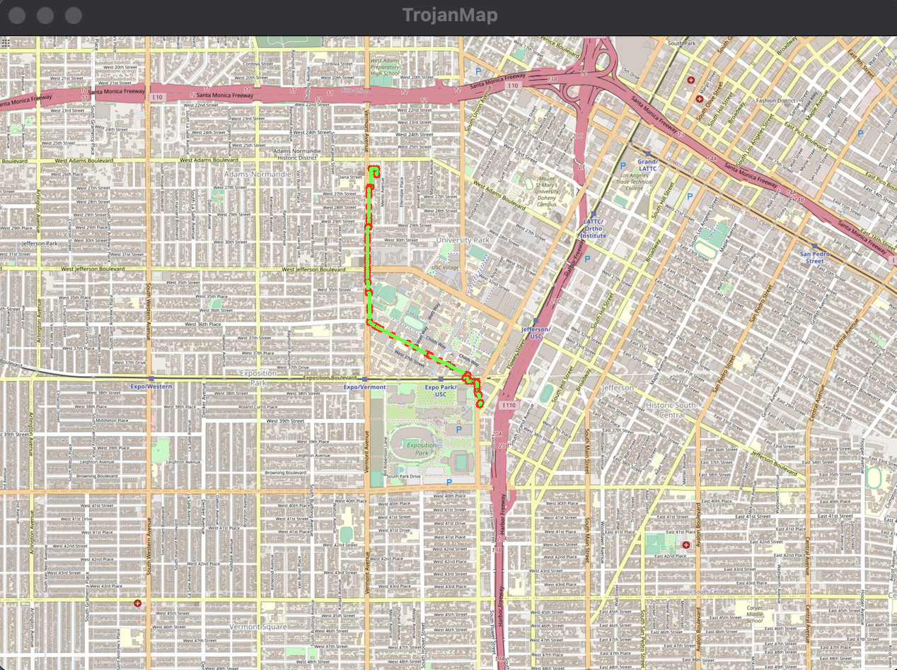</p>

### 3.2 Bellman_Ford
```c++
std::vector<std::string> CalculateShortestPath_Bellman_Ford(std::string &location1_name, std::string &location2_name);
```
In Bellman_Ford function, the main idea is to relax all the edges during each iteration, and same like the dijkstra, we need to put the pre matrix to keep tracking the path
```c++
  std::vector<std::string> path;
  std::unordered_map<std::string, double> distance; //distance map of the nodes
  std::string start, end; // the id of location1 and location2
  std::unordered_map<std::string, std::string> pre; //record the node and its predecessor
```

### 3.2.1 Bellman_Ford Results
**Time complexity:**: O(n*m), n represents the number of nodes and m represents the number of edges in the map.
```shell
*************************Bellman_Ford*************************
*************************Results******************************
"2578244375","4380040154","4380040153","4380040152","4380040148","6818427920","6818427919","6818427918","6818427892","6818427898","6818427917","6818427916","7232024780","6813416145","6813416154","6813416153","6813416152","6813416151","6813416155","6808069740","6816193785","6816193786","123152294","4015203136","4015203134","4015203133","21098539","6389467809","4015203132","3195897587","4015203129","4015203127","6352865690","6813379589","6813379483","3402887081","6814958394","3402887080","602606656","4872897515","4399697589","6814958391","123209598","6787673296","122728406","6807762271","4399697304","4399697302","5231967015","1862347583","3233702827","4540763379","6819179753","6820935900","6820935901","6813379556","6820935898","1781230450","1781230449","4015405542","4015405543","1837212104","1837212107","2753199985","6820935907","1837212100","4015372458","6813411588","1837212101","6814916516","6814916515","6820935910","4547476733",
The distance of the path is:1.49919 miles
**************************************************************
Time taken by function: 4892 ms
```
<p align="center"></p>

### 3.3 Runtime compared between Dijkstra and Bellman-Ford

We listed servel examples to compare the runtime between Dijkstra and Bellman_Ford. 
Dijkstra choose the nodes with the minimum distance to the source that hasn't been visited, and do the edge relaxation process on all of its outgoing edges. While Bellman-Ford just do edge relaxation for all edges in the map and do this n-1 times. n is the number of nodes. 
Bellman-Ford performs check on all the nodes, while Dijkstra just check the one with the shortest distance. 
Therefore, when there is no negative edges, Dijkstra performs better than Bellman-Ford.

<p align="center">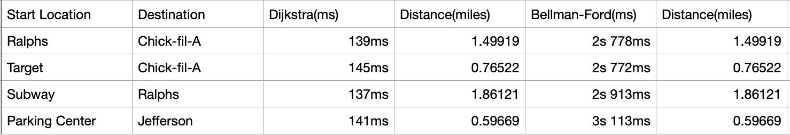</p>

The runtime of Dijkstra is much less than the Bellman_Ford.

## Step4: The Traveling Trojan Problem(AKA Traveling Salesman Problem)
### 1. Brute Force Function:
```c++
std::pair<double, std::vector<std::vector<std::string>>> TravellingTrojan_Brute_force(
      std::vector<std::string> location_ids);
  void Backtrack_Brute_Force(std::vector<std::string> &points, std::vector<std::vector<std::string>> &res, 
                          int current, double &pathlen, std::vector<std::string> &optimal_path);
```
We use Backtracking algorithm to solve Traveling Trojan Problem.

- While implementing backtracking, we use swap function to swap the positions of two nodes in the vector to get different permutations. We also set a pointer to record the index of swapping node. 
- When the pointer reaches the end of the vector, it means a route is found. Then we compare the route with current shortest path and do updates.

**Time complexity:** $O(n*n!)$.

### 1.1 Result
- 8 Places
```shell
**************************************************************
* 4. Travelling salesman problem                              
**************************************************************
Please input the number of the places:8
"2611809723","1855166394","7863341789","4020099344","611590772","8383157985","6799110601","5621164977",
Calculating ...
*************************Results******************************
TravellingTrojan_Brute_force
"2611809723","611590772","6799110601","4020099344","1855166394","8383157985","7863341789","5621164977","2611809723",
The distance of the path is:7.96032 miles
**************************************************************
You could find your animation at src/lib/output0.avi.          
Time taken by function: 53 ms
```
<p align="center">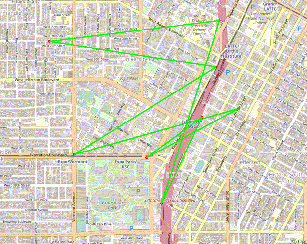</p>
<p align="center">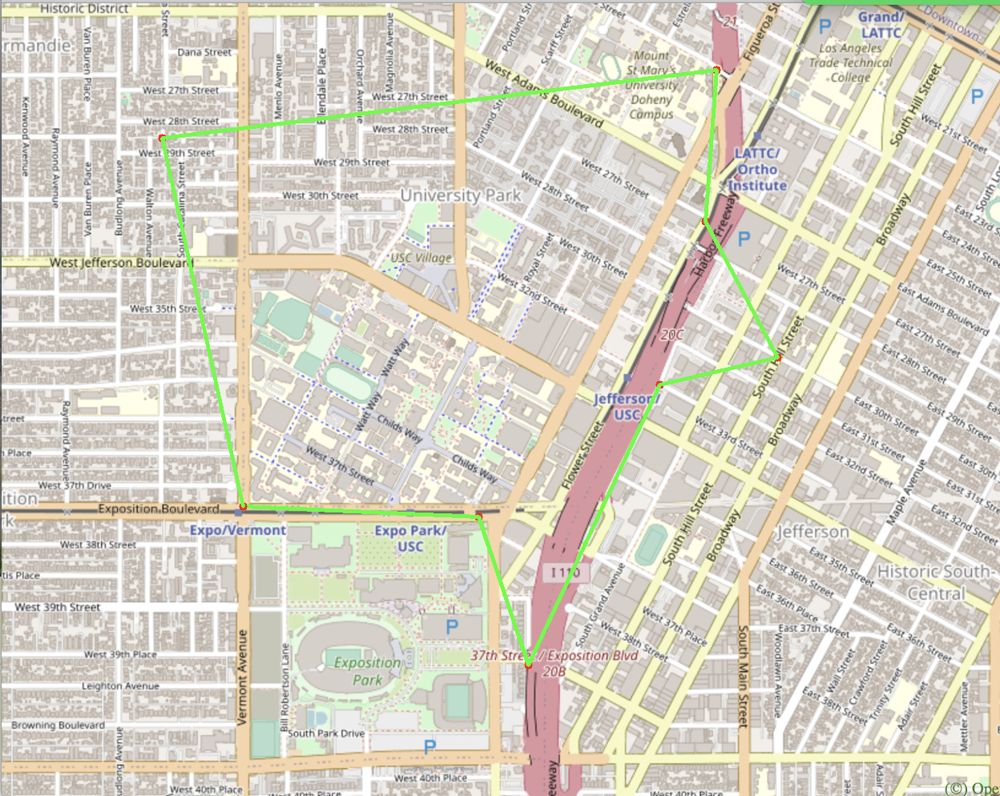</p>

- 10 Places
```shell
**************************************************************
* 4. Travelling salesman problem                              
**************************************************************
Please input the number of the places:10
"4400708470","4012726933","6815190471","8566227688","123602659","123018177","3574052733","7811710151","6314934798","6455606410",
Calculating ...
*************************Results******************************
TravellingTrojan_Brute_force
"4400708470","6455606410","123018177","6815190471","6314934798","7811710151","8566227688","123602659","3574052733","4012726933","4400708470",
The distance of the path is:12.1031 miles
**************************************************************
You could find your animation at src/lib/output0.avi.          
Time taken by function: 4942 ms
```
<p align="center">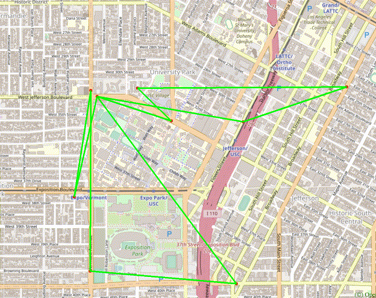</p>
<p align="center">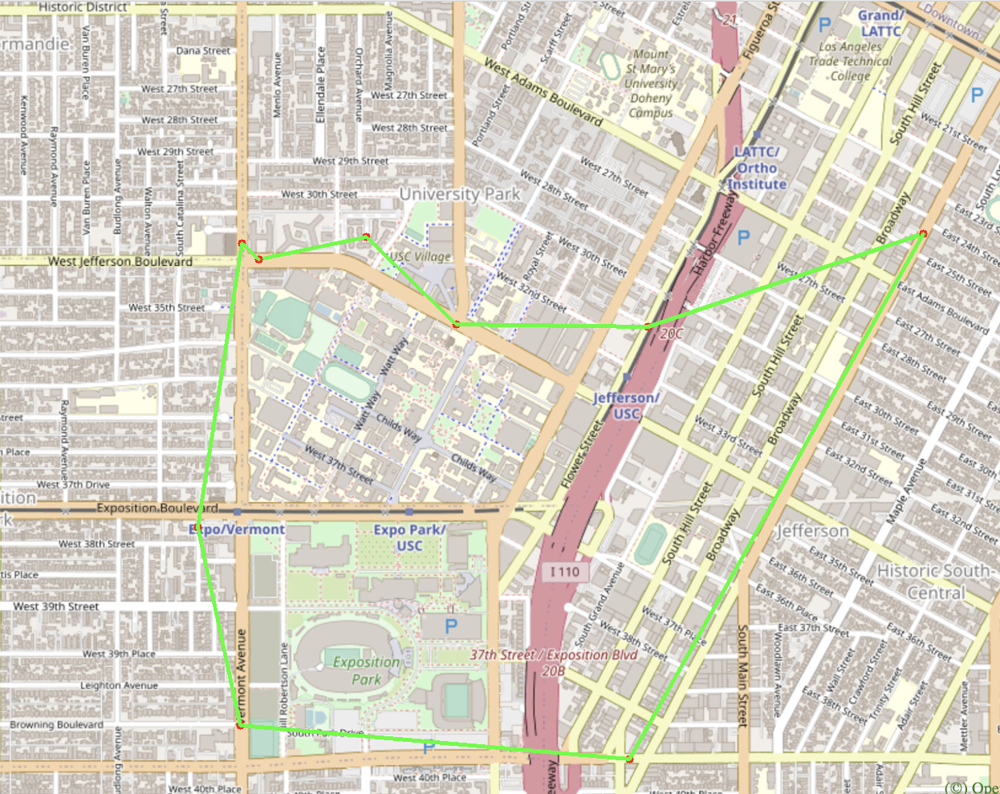</p>

### 2. Backtracking Function:
```c++
std::pair<double, std::vector<std::vector<std::string>>> TravellingTrojan_Backtracking(
      std::vector<std::string> location_ids);
  void Backtracking(std::vector<std::string> &points, std::vector<std::vector<std::string>> &res, 
                          int current, double &cur_length, double &path_length, std::vector<std::string> &optimal_path);
```

We use a if statement to implement early backtracking. When the current distance is larger than the current minimum distance, we just skip the case and continue to the next permutation. Therefore, we can save the time.
**Time complexity:**$O(n*n!)$.
### 2.1 Results
- 10 Places
```shell
**************************************************************
* 4. Travelling salesman problem                              
**************************************************************
Calculating ...
*************************Results******************************
TravellingTrojan_Backtracking
"4400708470","6455606410","123018177","6815190471","6314934798","7811710151","8566227688","123602659","3574052733","4012726933","4400708470",
The distance of the path is:12.1031 miles
**************************************************************
You could find your animation at src/lib/output0_backtracking.avi.
Time taken by function: 342 ms
```

<p align="center">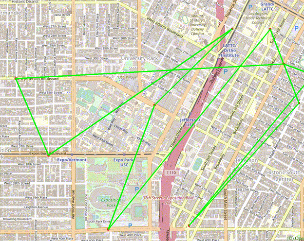</p>
<p align="center">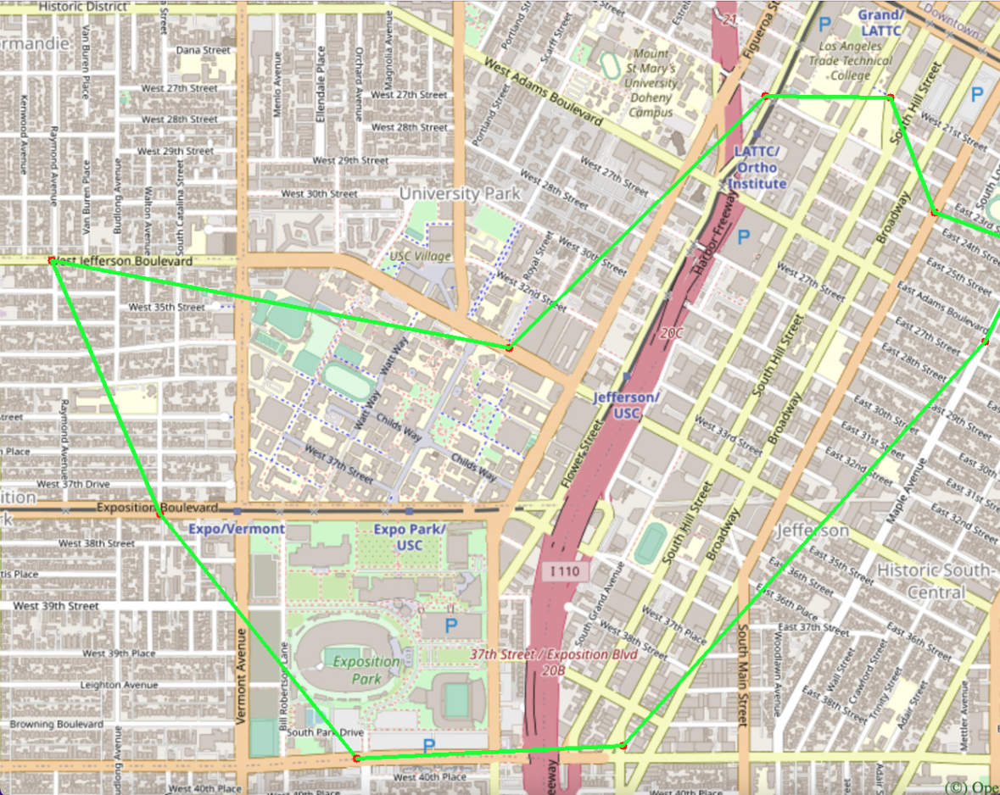</p>


### 3. 2-opt problem Function:
```c++
  std::pair<double, std::vector<std::vector<std::string>>> TravellingTrojan_2opt(
      std::vector<std::string> location_ids);
```
We implement 2-opt algorithm to solve the Traveling Trojan Problem.
- We use swapping mechanism here, reversing part of the nodes to reorder them and get a new permutation. 
- Two for-loops are used to compare every possible possible route. If the new route is shorter, we continue to find the next route. While if it's longer, we will use the previous route to continue the loop.
- Break the loops while there is no updates to the shortest route.

**Time complexity:** each while loop is $O(n^2)$.
### 3.1 Results
- 10 Places
```shell
**************************************************************
* 4. Travelling salesman problem                              
**************************************************************

Please input the number of the places:10
TravellingTrojan_2opt

The distance of the path is:9.67577 miles
**************************************************************
You could find your animation at src/lib/output0_2opt.avi.     
Time taken by function: 1874 ms
```
<p align="center">
  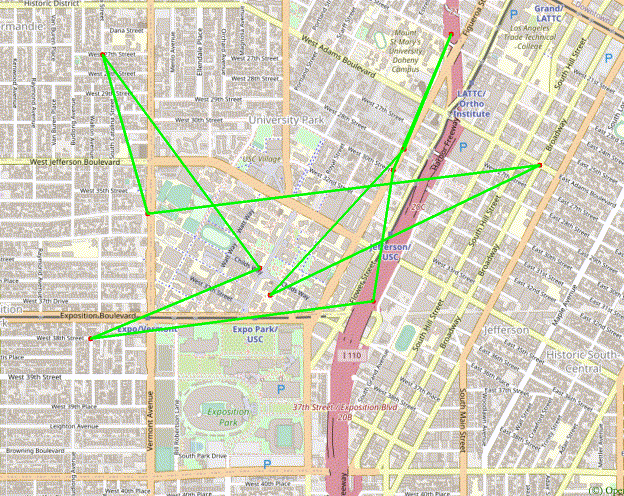
  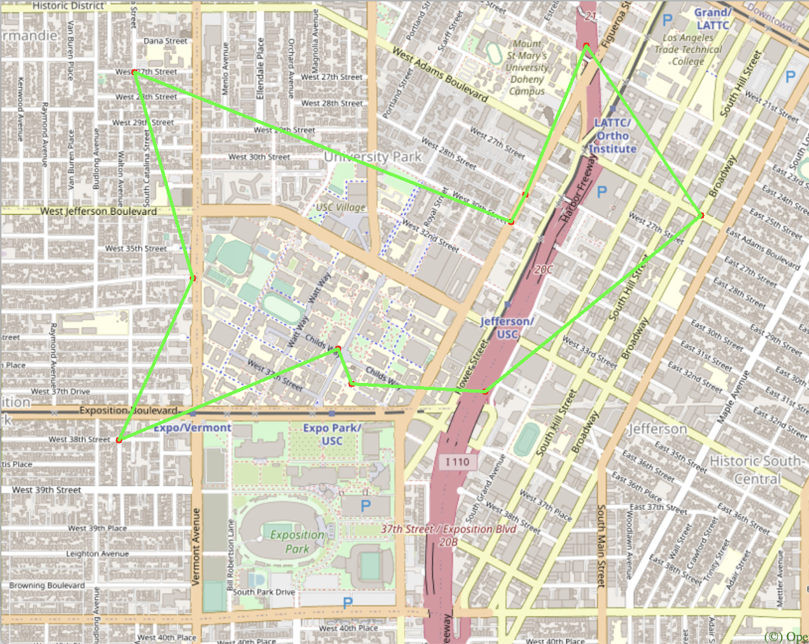 
</p>


```shell
- 20 Places
**************************************************************
* 4. Travelling salesman problem                              
**************************************************************

Please input the number of the places:20
TravellingTrojan_2opt

The distance of the path is:10.3046 miles
**************************************************************
You could find your animation at src/lib/output0_2opt.avi.     
Time taken by function: 1874 ms
```
<p align="center">
  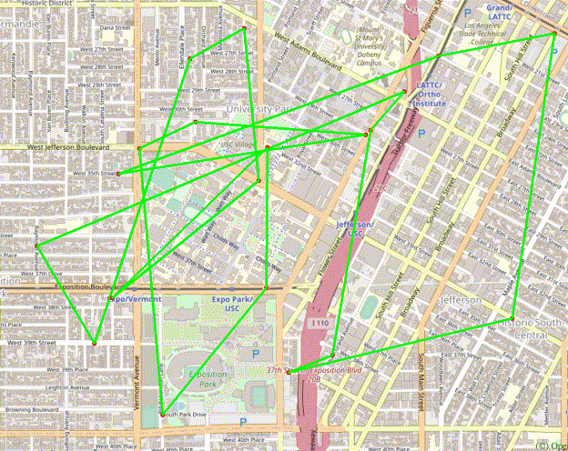
  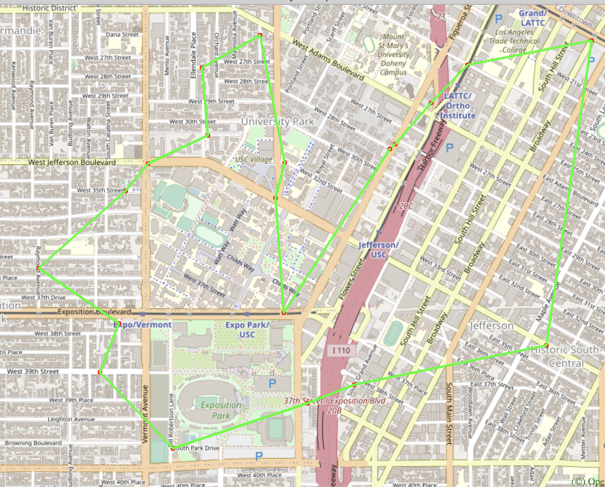 
</p>


```shell
- 30 Places
**************************************************************
* 4. Travelling salesman problem                              
**************************************************************

Please input the number of the places:30
TravellingTrojan_2opt

The distance of the path is:10.2354 miles
**************************************************************
You could find your animation at src/lib/output0_2opt.avi.     
Time taken by function: 24678 ms
```
<p align="center">
  
  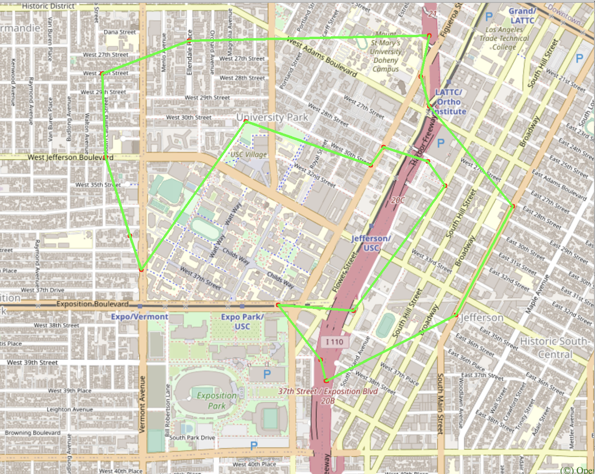 
</p>


### 4. 3-opt
We implement 3-opt algorithm
- We use three for loops to get three different nodes, whose index are i, j, k. i, j, k should satisfy i<j<k or j<k<i or k<i<j.
- Using these three nodes as three breaking points to the route. The route is seperated to three parts. We can then find eight different routes by reversing and swaping the three parts.
- If the length of the new route is shorter, we continue to find the new three nodes(index: i, j, j). Or we will check all the eight routes. When there is no update, we break the loops.

**Time complexity:** each while loop is $O(n^3)$.

### 4.1 Results
- 10 Places
```shell
**************************************************************
* x  Extra credit Travelling salesman problem 3-Opt, Genetic                           
**************************************************************
Please input the number of the places:10
"123153819","123280946","214470820","6814452675","1841016351","8566227744","1967750283","1870795249","4872900581","7811483260",

*************************Results******************************
TravellingTrojan_3opt
"123153819","214470820","1967750283","8566227744","4872900581","1841016351","7811483260","6814452675","1870795249","123280946","123153819",
The distance of the path is:9.79864 miles
**************************************************************
You could find your animation at src/lib/output0_3opt.avi.     
Time taken by function: 24871 ms
```
<p align="center">
  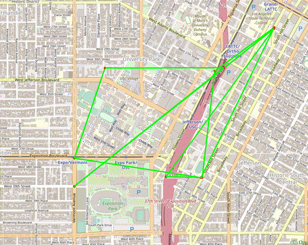
  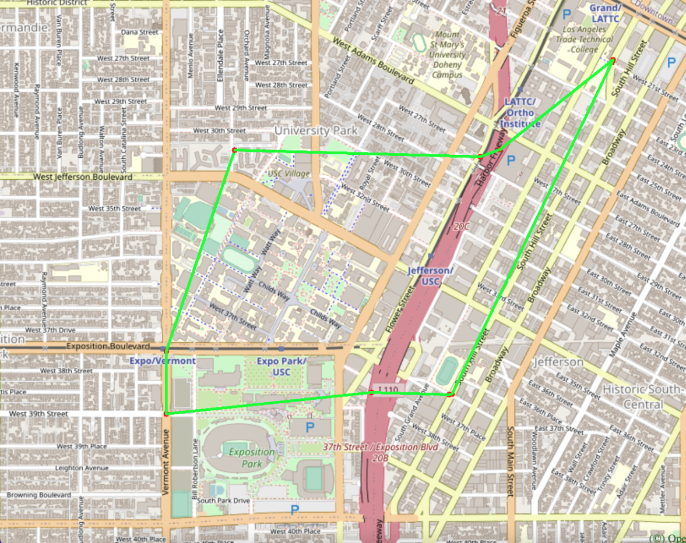 
</p>

- 20 Places
```shell
**************************************************************
* x  Extra credit Travelling salesman problem 3-Opt, Genetic                           
**************************************************************
Please input the number of the places:20

*************************Results******************************
TravellingTrojan_3opt

The distance of the path is:9.79864 miles
**************************************************************
You could find your animation at src/lib/output0_3opt.avi.     
Time taken by function: 286930 ms
```
<p align="center">
  
  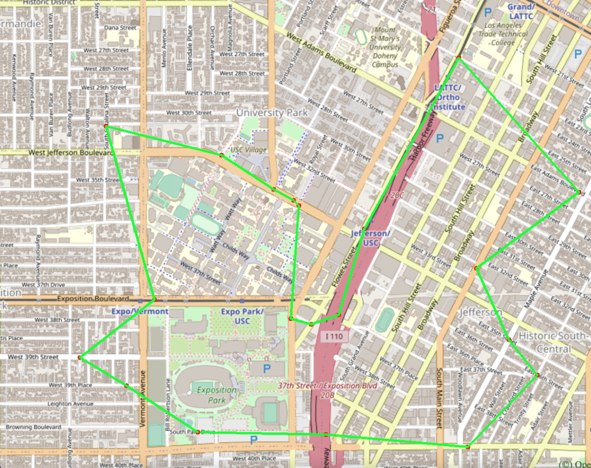 
</p>

- 30 Places
```shell
**************************************************************
* x  Extra credit Travelling salesman problem 3-Opt, Genetic                           
**************************************************************
Please input the number of the places:20

*************************Results******************************
TravellingTrojan_3opt

The distance of the path is:is:10.2354
**************************************************************
You could find your animation at src/lib/output0_3opt.avi.     
Time taken by function: 2141239 ms
```
<p align="center">
  
  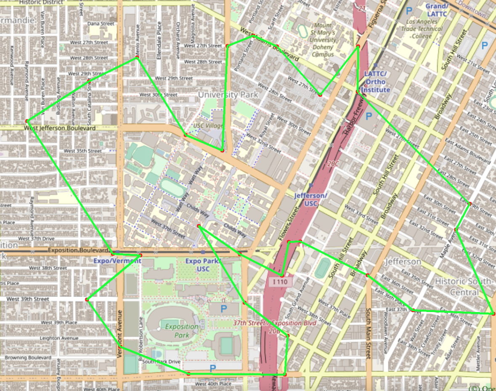 
</p>


### 5. Runtime compared between Brute force, backtracking, 2-opt, 3-opt and Genetic
<p align="center">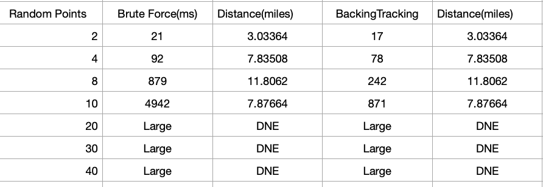</p>
The runtime of brute force is much higher than others when the number of nodes get larger.
In this experiment, I run random number with 2,4,8,10,20,30,40 cases using the above algorithms.
- For Bruteforce and Backtracking these kinds of exhaustive search, the results are definitely right, but it takes too long for the algorithms to run. The exhaustive search is not practical for too many nodes.

<p align="center">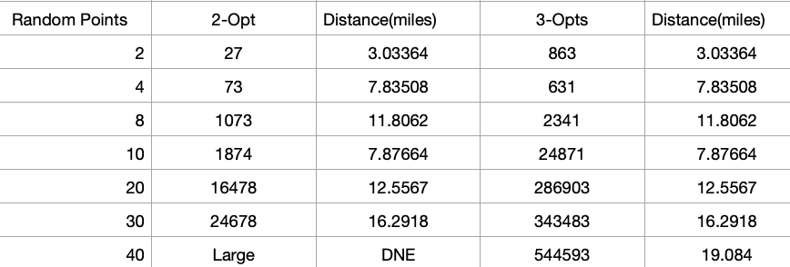</p>
- For 2-opt and 3-opt, I tried up to 30 inputs, and the results of the two algorithms are all optimal. They also don't need too much time to run. Therefore, when there are more than 15 inputs, the heuristic implementation is preferred.

## Step5: Cycle Detection
### 5.1 Function:
```c++
// Check whether the id is in square or not
  bool inSquare(std::string id, std::vector<double> &square);
  // Get the subgraph based on the input
  std::vector<std::string> GetSubgraph(std::vector<double> &square);
  // Given a subgraph specified by a square-shape area, determine whether there is a
  // cycle or not in this subgraph.
  bool CycleDetection(std::vector<std::string> &subgraph, std::vector<double> &square);
  void hasCycle(std::string cur_id,std::unordered_map<std::string,bool>&visited, std::string par_id,std::vector<double> &square,bool &flag);
```
We use a square-shaped subgraph of the original graph by using four corrdinates. And it follows the order of left, right, upper and lower bounds. We are tring to determine if there is a cycle path in that subgraph.
First, we can get the left, right, upper and lower bounds from the ```std::vector<double> square```. Second, we go through the data's latitude and longtitude to see any points are in the square and we push back to vector which named points. We are using DFS for the cycle detection, we need to consider the parent in the cycle detection incase there are two nodes that is detected as a cycle.And go through all the points using recursive DFS. Eventually, we plot the path and square out.

**Time complexity:** $O(m+n)$. m represents the number of edges in the map and n represents the number of nodes.

### 5.2 Results:
```shell
**************************************************************
* 5. Cycle Detection                                          
**************************************************************

Please input the left bound longitude(between -118.320 and -118.250):-118.30
Please input the right bound longitude(between -118.320 and -118.250):-118.26
Please input the upper bound latitude(between 34.000 and 34.040):34.039
Please input the lower bound latitude(between 34.000 and 34.040):34.001
*************************Results******************************
there exist cycle in the subgraph 
**************************************************************
Time taken by function: 30961 ms
```
<p align="center">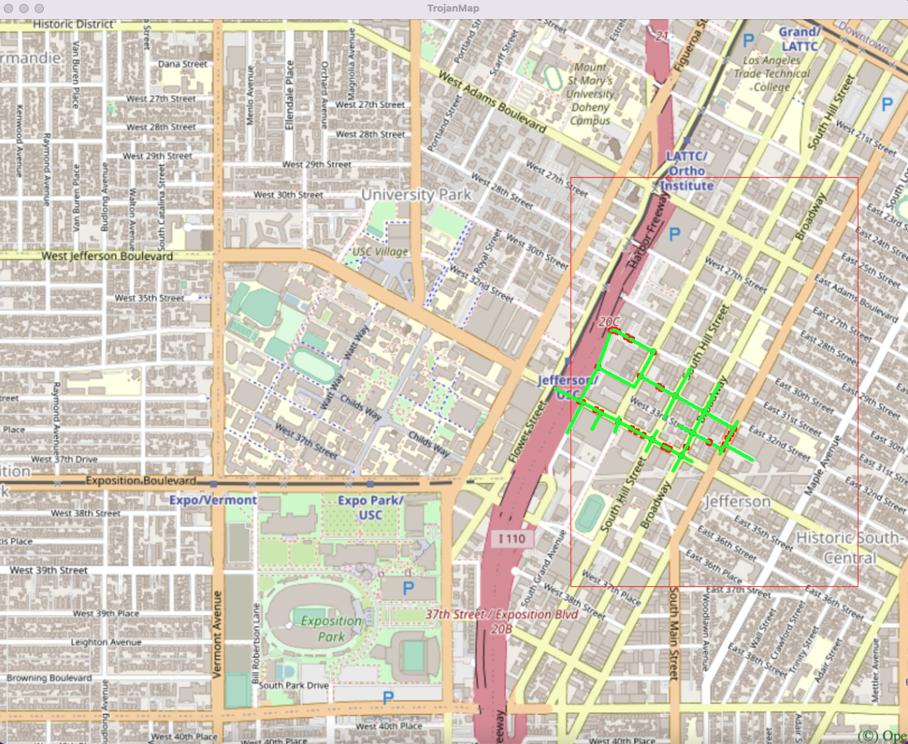</p>

## Step 6: Topological Sort:
### 6.1 Function:
```c++
// Given CSV filename, it read and parse locations data from CSV file,
  // and return locations vector for topological sort problem.
  std::vector<std::string> ReadLocationsFromCSVFile(std::string locations_filename);
  // Given CSV filenames, it read and parse dependencise data from CSV file,
  // and return dependencies vector for topological sort problem.
  std::vector<std::vector<std::string>> ReadDependenciesFromCSVFile(std::string dependencies_filename);
  // Given a vector of location names, it should return a sorting of nodes
  // that satisfies the given dependencies.
  std::vector<std::string> DeliveringTrojan(std::vector<std::string> &location_names,
                                            std::vector<std::vector<std::string>> &dependencies);

```
We mainly use DFS to realize Topological Sort.
- First, we initialize the edge map which contains the node and its neighbors and the mark map which is used to record whether the node has been marked.
- Then we use DFS and mark map to recursivly access every node in ```locations```. Through using DFS, we will get the deepest node first. Therefore, to get the final result, we need to reverse the original result obtained by DFS.

**Time complexity:** If m>=n, it's O(m); if n>m, it's O(n). m represents the number of edges(the length of ```dependencies```). n represents the number of nodes in ```locations```.
Obtaining the edge map costs O(m). The time complexity of DFS is O(n).

### 6.2 Results:
```shell
**************************************************************
* 6. Topological Sort                                         
**************************************************************

Please input the locations filename:/Users/James/final-project-JiayuGuo3225/input/topologicalsort_locations.csv
Please input the dependencies filename:/Users/James/final-project-JiayuGuo3225/input/topologicalsort_dependencies.csv 
*************************Results******************************
Topological Sorting Results:
Ralphs
Chick-fil-A
KFC
**************************************************************
Time taken by function: 0 ms
```
<p align="center">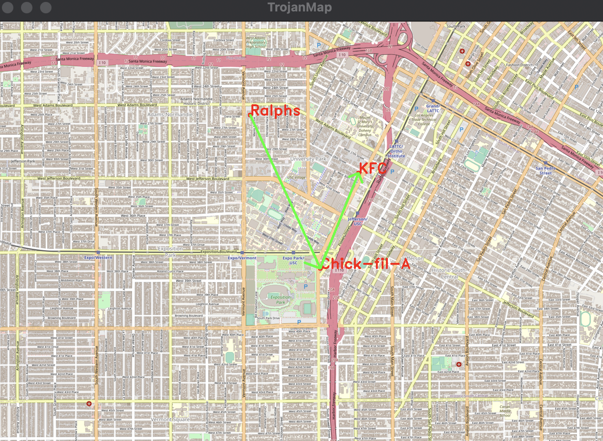</p>


## Step 7: Find Nearby
### 7.1 Function:
```c++
// Given a location id and k, find the k closest points on the map
  std::vector<std::string> FindNearby(std::string, std::string, double, int);
```
In this problem, we mainly traverse all the data with the specific attribute and then calculate the distance between it with the input location. We use the priority queue to store the locations.

**Time complexity** :The time complexity of this function is O(n) 
### 7.2 Results:
```shell
**************************************************************
* 7. Find Nearby                                              
**************************************************************

Please input the attribute:bank
Please input the locations:Ralphs
Please input radius r:10
Please input number k:10
*************************Results******************************
Find Nearby Results:
1 USC Credit Union
2 Bank of America
3 Chase
**************************************************************
Time taken by function: 6 ms
```
<p align="center">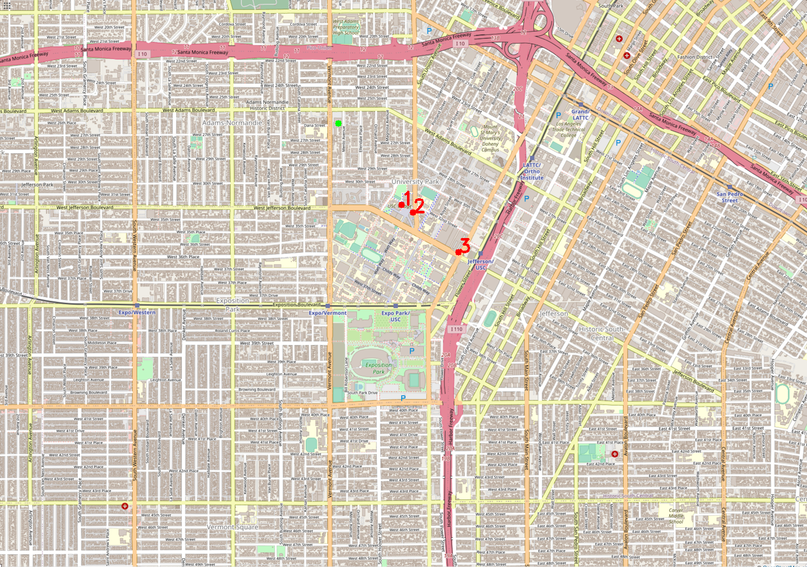</p>


## Last Chapter: Conclusion and lessons learned
First of all the C++ is not my first language and I can say I am kind of hate this language before take the EE538, but after this whole semester, I kind of love this language, because the Professor and the TAs help.

In this semester, I learn the how to use VS code and how to use the googel bazel.And we can step-wise debug to analysis how to modify it. Besides, we know how to determine the time complexity and it can help us to know which way goes faster.

Second, for Data data structure such as STL container vector, map, lists, graph, tree and so on, I learn lots of Data structure knowledge and do a lot of relative pratice in homework and go through good example in leature and Discussion. It is very helpful to implement some of them into the project and we know which one we need to use.

Third, we also learned a lot of algorithms such as sorting, we implement the Topological sort and backtracking, we use it in TSP problem, and dynamic programming, we use it in like Fibonacci and so on  and use  Dijkstra,  Bellman-Frod to calculate the shortest path. We know  servel algorithms and how to use it and implement it into a practical problems. 

Last but not the least, I think professor Arash is really a good professor and TAs as well, they did a great job in this semester. Appreciated it and thank you.

